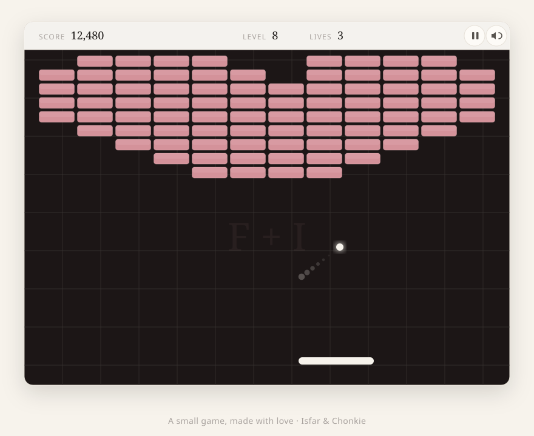

# DX Ball

A small brick-breaker, built by Isfar for Chonkie, for our 2nd anniversary.

It is one HTML file, no build step, no dependencies. Just a canvas, some love, and a heart you have to break through to win.

**▶ Play it live: https://isfarbaset.github.io/dx-ball/**



## Play it

Play it live at **https://isfarbaset.github.io/dx-ball/**, or open `index.html` in any browser.

To run it locally:

```bash
python3 -m http.server 8755
# then open http://localhost:8755
```

## How to play

- **Move the paddle** with your mouse (or your finger on a touchscreen).
- **Click** or press **Space** to serve the ball.
- **Space / Escape** pauses the game.
- **M** toggles sound.
- Clear all the bricks to move to the next level. Don't let the ball drop.

## On your phone

The board adapts to your screen. In landscape it is a wide 4:3 field, and in portrait it switches to a dedicated tall playfield built for one hand. Drag to move the paddle, tap to serve, and use the pause and sound buttons in the top corner (no keyboard needed).

## Eight levels

It starts gentle and does not stay that way. The ball speeds up the longer a rally goes, and every level starts a little faster than the last.

1. A Fresh Start
2. Building Together
3. Through Thick & Thin
4. Side by Side
5. The Long Drives
6. Quiet Sunday Mornings
7. Two Years Strong
8. Forever & A Day

Each level has its own layout, from solid walls to corridors, scattered windows, a diamond, and a final board shaped like a heart.

## Power-ups

Break bricks and they sometimes drop a power-up. Catch it with the paddle.

- **W** wider paddle
- **M** multi-ball
- **S** slow the ball down
- **+** an extra life (up to five)

## Combos

Keep breaking bricks before the ball comes back to the paddle and your combo climbs, up to a 5x multiplier. The score popups turn gold when you are on a streak.

## Built with

Vanilla HTML, CSS, and the Canvas 2D API. The sound is generated live with the Web Audio API, so there are no audio files to load.

---

Two years down. Here's to many more.
